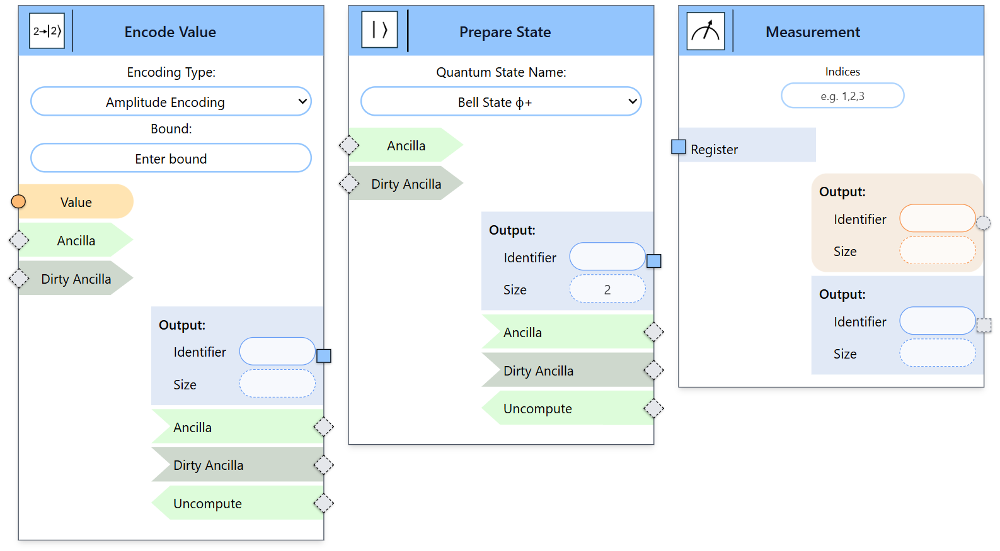

Boundary Nodes
--------------

The following boundary nodes are supported:

- **Encode Value**: Converts a classical value to a quantum state using an encoding type and error bound. Exact preparation (error zero) is not always possible. This mode has one input (classical value) and one output (quantum state). Custom encodings are supported.

- **Prepare State**: Initializes a named quantum state from predefined or custom options.

- **Measurement**: Takes one quantum register input and produces two outputs: classical measurement results and the post-measurement quantum state. Users can select specific qubits to measure. Measurements default to the Z-basis but other bases can be chosen using Pauli strings.

