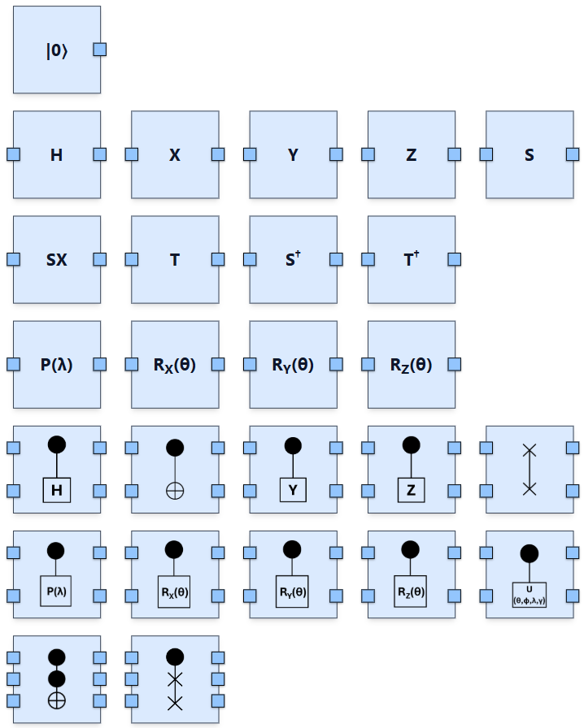
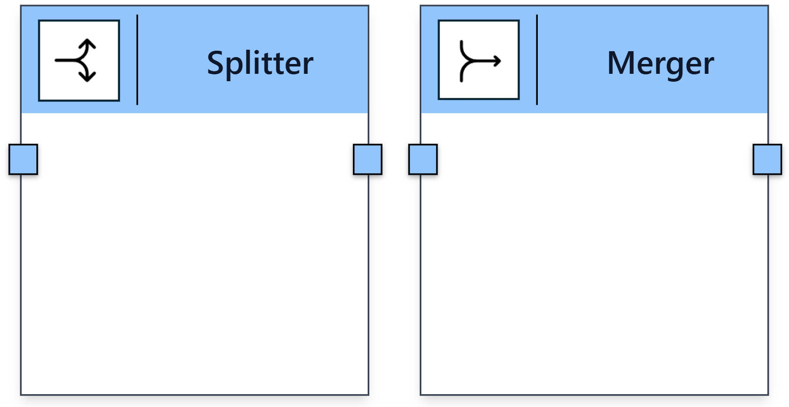

Circuit-Level Nodes
-------------------

At the circuit level, the modeler includes quantum gates and a qubit element. The qubit is a source node with one output port. Gates are modeled by arity: single-qubit gates have one input and one output, two-qubit gates have two, and so on.

Gates are either non-parameterized or parameterized. Parameterized gates display required float parameters, which must be set by the user and can be expressed in radians or degrees. The number of parameters is fixed and visually indicated.

The model also supports broadcasting, allowing gates to apply element-wise across equally sized registers. 

   Illustration of circuit-level quantum gates and qubit nodes.

Splitter and Merger nodes support register manipulation. A Splitter divides a quantum register into individual qubits, requiring a specified size. A Merger combines single qubits into a quantum register.

   Illustration of the Splitter and Merger modeling constructs.

