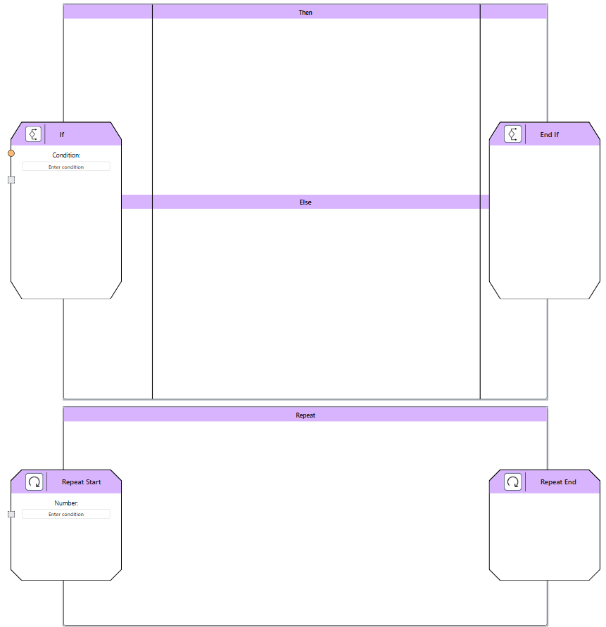

Control Structure Nodes
------------------------

Control structure nodes enable conditional execution and repetition of quantum operations. The supported nodes are:

- **Repeat**: Executes the contents of the node a fixed number of times, defined by the *repetitions* property. Inputs and outputs must match to maintain consistency across iterations. Ancilla inputs are allowed.

- **If-Else**: Executes based on a single classical input as a *condition*. Both *if* and *else* branches must have matching input and output types and sizes. If one branch is empty, it behaves as an identity. New variables can be defined inside these blocks, but they remain local to the block's scope.

