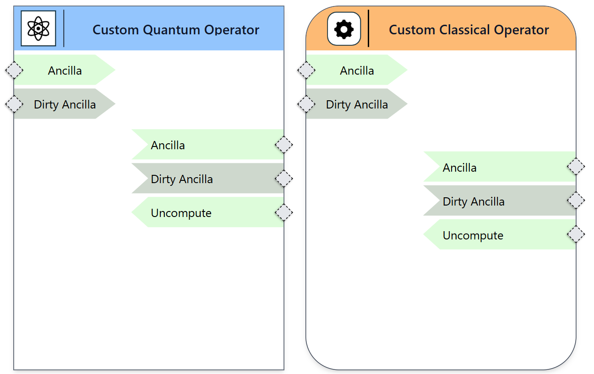

Custom Nodes
------------

To support flexibility beyond predefined functionality, the modeling framework allows the creation of custom nodes.

- Custom nodes can be defined for both classical and quantum contexts.
- Users can specify an arbitrary number of input and output ports using configurable properties.
- This enables modeling of non-standard or complex operations that may not be covered by built-in node types.
- Custom nodes allow the tool to adapt to user-specific logic and evolving modeling needs.
 

