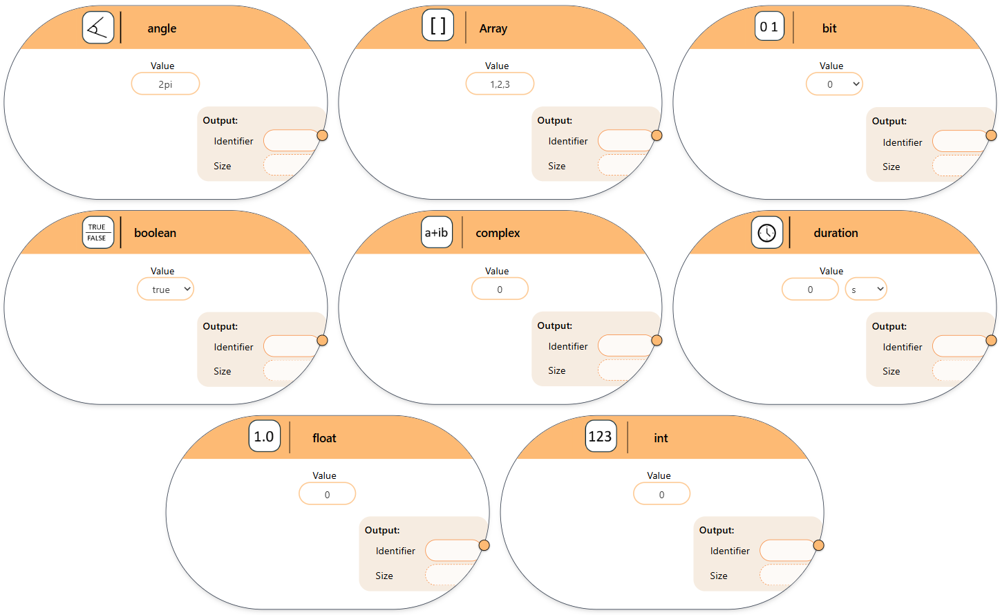
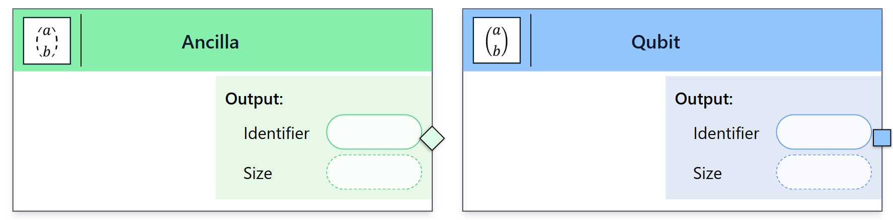

Data Types
----------

In modeling tools that support both classical and quantum paradigms, data types are used to represent information. 

Classical data types can include a value, an output identifier and an optional size. If the size is specified, it must be greater than zero and is used directly. If no size is given, it is considered machine-dependent and resolved by the backend.

   Classical data types used in the modeling tool.

Quantum data types, such as ancillae, are always initialized in the :math:`\ket{0}` state and do not require an explicit value. Both classical and quantum data types serve as source elements in the model. They do not have input ports but provide a single output port to connect their data or state to subsequent elements.

   Quantum data types used in the modeling tool.
