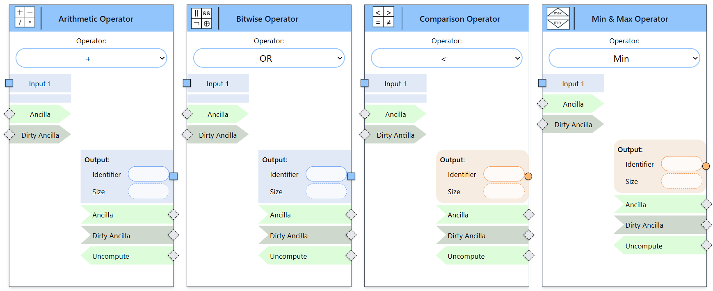
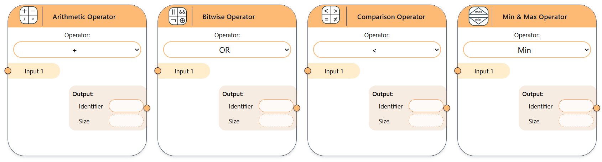

Operators
---------

Operators are grouped into arithmetic, bitwise, comparison, and min/max categories.

- **Arithmetic, bitwise, and comparison** operators take two inputs.
- **Min/max** operators take a single input collection.

Output types vary by category:
- Arithmetic operators produce quantum outputs.
- Bitwise, comparison, and min/max operators produce classical outputs.

Each node has an *operator* property to define its function.

- **Supported operators:**

   - Arithmetic: `+`, `-`, `*`, `/`, `%`
   - Bitwise: `AND`, `OR`, `XOR`, `NOT`
   - Comparison: `==`, `!=`, `<`, `<=`, `>`, `>=`
   - Min/Max: `min`, `max`

   Quantum Operators 

   Classical Operators 

