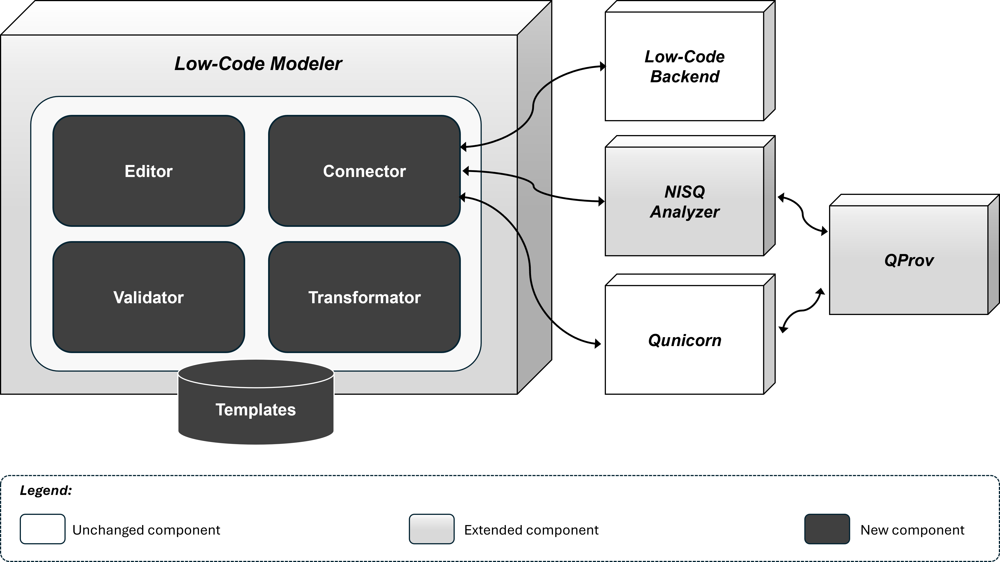
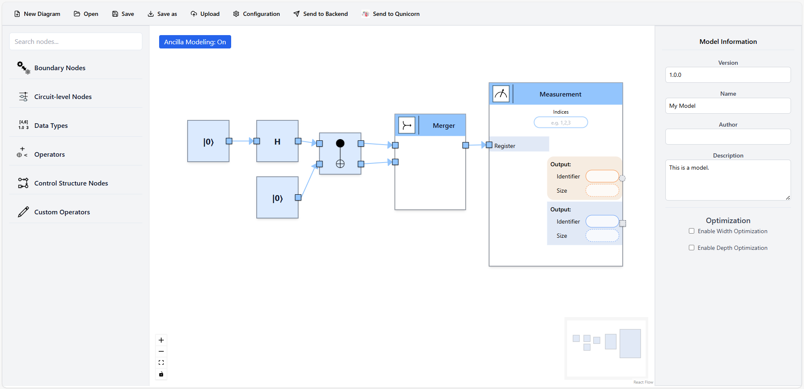

Project Introduction
====================

Project Description
-------------------

This quantum low-code tool enables users to model quantum algorithms combining classical and quantum logic in a visual, node-based interface.

The main components of the *Low-Code Modeler*:

- **Editor**: drag-and-drop interface for modeling quantum applications using visual constructs  
- **Validator**: checks syntactic and semantic correctness of the created models  
- **Transformer**: prepares the validated model for backend processing  
- **Connector**: integrates external services into the modeling process  
- **Template Library**: provides reusable templates to accelerate development  

The system interacts with the following components:

- **Low-Code Backend:** enriches modeling constructs with corresponding OpenQASM 3 implementations, selecting or adapting them based on the required circuit width. Returns the resulting OpenQASM code to the frontend.  
- **NISQ Analyzer:** helps select suitable quantum devices and filters out backends that do not support conditional operations.  
- **QProv:** continuously collects and stores information about available quantum devices and supports the updated selection logic.  
- **Qunicorn:** executes the OpenQASM code once a suitable backend is selected.

   System architecture of the quantum low-code tool.

User Interface
-------------------

The modeler interface consists of several components that facilitate the creation and execution of quantum applications.

At the top of the screen is the *toolbar*, which provides functions such as:

- *New Diagram*
- *Open*
- *Save*
- *Save As*
- *Upload*
- *Configuration*
- *Send to Backend*
- *Send to Qunicorn*

These options enable users to manage files, configure the modeling tool, and deploy quantum applications. Tooltips and visual feedback confirm actions and enhance usability.

On the left side is the *palette*, offering a searchable, categorized list of modeling elements. Categories include:

- *Boundary Nodes*
- *Circuit Nodes*
- *Data Types*
- *Control Structure Nodes*
- *Operators*
- *Custom Operators*
- *ML Elements*

Users can drag and drop elements from the palette onto the canvas. Usability features include a responsive search bar, intuitive category labels, and collapsible groups to reduce visual clutter.

The central *canvas area* serves as the main workspace for diagram construction. It features a grid layout to support alignment and design precision. Users can interact with the canvas using keyboard and mouse controls, including:

- Zooming in and out
- Resetting the view
- Locking the canvas via controls located at the bottom left
- Keyboard shortcuts:

   - *Delete* to remove nodes
   - Arrow keys for moving elements
   - Lasso tool (hold *Shift*) to select multiple nodes
   - *Undo/Redo* functionality to support editing

Modeling Constructs and Blocks
-------------------

The quantum low-code tool provides modeling constructs for defining quantum applications at different levels of abstraction. In particular, quantum modeling constructs offer both higher-level abstractions and lower-level modeling blocks representing quantum gates, while supporting users across a broad spectrum of quantum computing expertise.

The constructs are organized into seven categories: Data Types, Circuit-Level Nodes, Boundary Nodes, Operators, Control Structure Nodes, Custom Nodes, and ML Elements. Each category includes visual elements that enable users to build quantum circuits, workflows, and logic in an intuitive way.

Detailed descriptions and examples for each construct type are provided in the corresponding subsections.

.. toctree::
   :maxdepth: 1
   :titlesonly:
   
   modelingconstructs_dataTypes
   modelingconstructs_circuitLevelNodes
   modelingconstructs_boundaryNodes
   modelingconstructs_operators
   modelingconstructs_controlStructureNodes
   modelingconstructs_customNodes
   modelingconstructs_mlNodes
